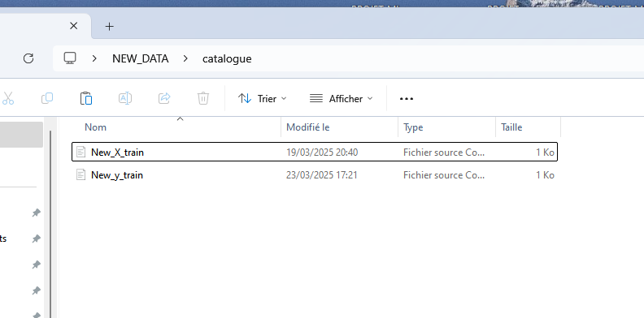
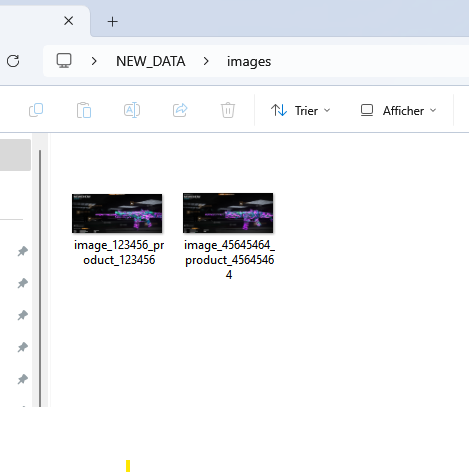
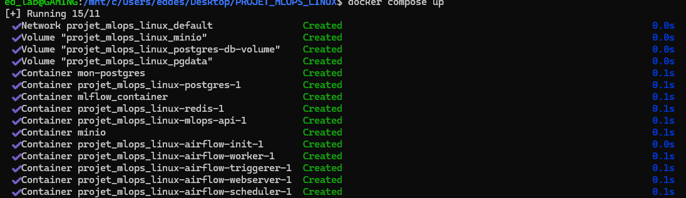

# 🛍️ MLOPS_PROJECT – Classification Multimodale de Produits Rakuten

## 📌 Description du projet

Cataloguer les produits selon des données différentes (textes et images) est crucial pour les plateformes e-commerce. Cela permet de développer des applications essentielles telles que :

- La recommandation personnalisée de produits
- La recherche intelligente par similarité ou contenu
- L’amélioration de l’expérience utilisateur

Dans ce projet, l'objectif est de **prédire le code type d’un produit** à partir :
- de **données textuelles** (désignation et description)
- et d’**images** des produits.

> Ce projet s’inscrit dans le cadre du challenge **Rakuten France Multimodal Product Data Classification** :  
> 📎 [https://challengedata.ens.fr/challenges/35](https://challengedata.ens.fr/challenges/35)

## 👥 Client

Le client est **Rakuten France**, plus précisément les **administrateurs du site Rakuten.fr**, qui souhaitent optimiser la classification de leur catalogue produits.

## ⚙️ Aspects spécifiques du projet

- 📦 Déploiement d’un modèle de deep learning en production
- ⚡ Garantie de la rapidité d’exécution (latence faible en inférence)
- 🔁 Traitement multimodal (texte + image)
- 🏷️ Classification sur plus de 1000 classes

## 📚 Ressources

- **Données textuelles** (~60 Mo) : désignation + description
- **Données images** (~2,2 Go) : une image par produit
- **Ensemble de données** : ~99 000 exemples
- 🔗 [Données disponibles ici](https://challengedata.ens.fr/challenges/35)

## 📁 Arborescence du projet

```
📁 MLOPS_PROJECT
├── 📁 .github
│   └── 📁 workflows
├── 📁 airflow
│   ├── 📁 config
│   ├── 📁 dags
│   │   └── 📁 __pycache__
│   └── 📁 logs
│       ├── 📁 dag_processor_manager
│       └── 📁 scheduler
│           ├── 📁 2025-05-02
│           │   └── 📁 native_dags
│           │       └── 📁 example_dags
│           │           ├── 📁 plugins
│           │           └── 📁 subdags
│           ├── 📁 2025-05-03
│           │   └── 📁 native_dags
│           │       └── 📁 example_dags
│           │           ├── 📁 plugins
│           │           └── 📁 subdags
│           └── 📁 2025-05-04
│               └── 📁 native_dags
│                   └── 📁 example_dags
│                       ├── 📁 plugins
│                       └── 📁 subdags
├── 📁 ext
│   └── 📁 __pycache__
├── 📁 models
├── 📁 references
├── 📁 reports
├── 📁 src
│   ├── 📁 data
│   │   ├── 📁 models
│   │   │   └── 📁 __pycache__
│   │   └── 📁 processed
│   ├── 📁 features
│   │   └── 📁 __pycache__
│   ├── 📁 models
│   │   └── 📁 __pycache__
│   └── 📁 visualization
└── 📁 utils
    └── 📁 __pycache__
```

## 🚀 Objectifs à venir

- ✅ Prétraitement et vectorisation des données textuelles
- ✅ Prétraitement et normalisation des images
- ✅ Modèle multimodal (texte + image)
- 🔄 Entraînement et validation
- 🌐 Déploiement (Airflow, FastAPI, Docker, etc.)
- 📊 Monitoring & MLOps pipeline

## 📘 Guide d'installation & utilisation

### 📥 Étape 0 : Cloner le dépôt Git

```bash
git clone https://url-de-votre-repo/MLOPS_PROJECT.git
cd MLOPS_PROJECT
```

### 🧱 Étape 1 : Préparer les dossiers de données

Avant tout, créez deux dossiers dans le dossier parent du projet pour accueillir les nouvelles données :

```bash
mkdir -p ../NEW_DATA/catalogue
mkdir -p ../NEW_DATA/images
```

**⚠️ Important :**  
Respectez la **nomenclature des fichiers** :
- Pour les fichiers CSV, utilisez exactement ces noms :
  - `New_X_train.csv`
  - `New_y_train.csv`

cf screen pour données texte :


cf screen pour données images :


#### 🐳 Étape 2 : Construire l’image Docker de l’API

Construisez l’image Docker à partir du Dockerfile spécifique :

```bash
docker build -f docker/Dockerfile -t mon_projet_mlops:latest .
```

#### ⚙️ Étape 3 : Lancer tous les services avec Docker Compose

Démarrez les services en utilisant **docker-compose.yml** (ne pas utiliser `docker-compose.ci.yml`) :

```bash
docker-compose up --build
```

Tous les services seront lancés automatiquement (API, base de données, MinIO, etc.).

Vous devriez avoir quelque chose comme ceci :



#### 🛠️ Étape 4 : Initialisation de la base de données et du bucket MinIO

Avant d'utiliser l'API, exécutez ces deux commandes pour initialiser la base PostgreSQL et créer le bucket MinIO :

```bash
docker exec <nom_conteneur_api> python /app/src/data/create_db_postgre.py
docker exec <nom_conteneur_api> python /app/src/data/create_bucket_minio.py
```

Remplacez `<nom_conteneur_api>` par le nom réel de votre conteneur (par exemple : `projet_mlops_linux-mlops-api-1`).

#### 🌐 Accéder à l'API

Une fois les services lancés, l’API FastAPI est accessible ici :

👉 [http://localhost:8000/docs](http://localhost:8000/docs)

(Possibilité également d'utiliser en local, le fichier my_app.py, après avoir créé un dossier avec un environnement virtuel contenant streamlit)